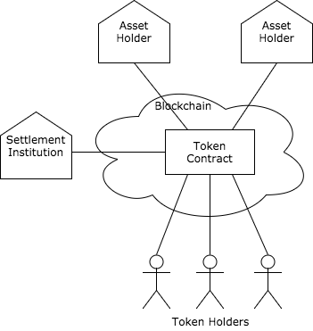
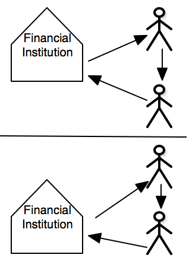
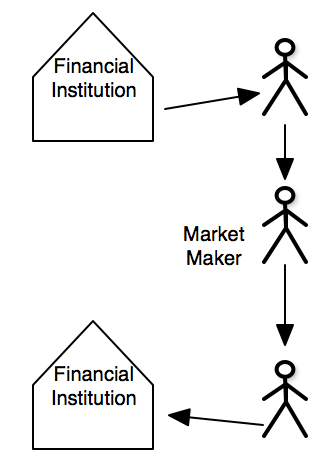

Asset-Backed Tokens for Ethereum platforms
==========================================

A [blockchain contract](#blockchain-contract) that facilitates the exchange of asset-backed tokens between token holders who have deposited an asset with an asset holder. The contract also facilitates the settlement of assets between asset holders held by a settlement institution.

# Why a distributed ledger?
## Alternative Payment Rail
**Credit transfers** of a fiat currency are simple to do but that's already available in a lot of places around the world using traditional payments technology. The key difference is the holder of the asset-backed tokens are in control. They only need to sign a transaction and then broadcast it for the transfer of their asset-backed tokens to be executed. They do not need to send instructions to a mediating financial institution that then executes the transfer with other financial institutions on their behalf.

**Direct debits** can also be supported like traditional payment systems. One advantage over traditional technology is debit limits that can be dynamically set by the debtor to each of their creditors. Coordinating debit limits between banks in real time is just too hard to achieve without a consensus layer with signed transactions.

**Escrow** of a fiat currency is expensive and time-consuming using traditional means but can be done easily on a distributed ledger. asset-backed tokens can be entrusted to a third party or a smart contract which will only execute when certain conditions have been met. It's also possible to setup multi signature escrows where m of n parties need to sign a transaction for the asset-backed tokens to be released.

## Delivery versus payment
When combined with other asset backed tokens on a distributed ledger, assets can be exchanged for fiat currency in one atomic transaction. That is, the distributed ledger ensures a payment is made for the delivery of an asset.

## Programmable money
When combined with smart contracts, payments can be made on conditions being met. This could be on condition of another transaction or elapsed time.

Payments can also be based on the state of a smart contract. For example, asset-backed tokens could be disbursed to the token holders based on the proportion of their tokens held.

# Design

## Principles
* Asset holders will on-boarded new customers.
* The association of the distributed ledger identity to the actual customer will be kept off the distributed ledger.
* Asset holders will issue the asset-backed token to their customers.
* Asset holders can only issue asset-backed tokens if they have enough fiat held in their account held at the settlement institution.
* Customers sign distributed ledger transactions with their own private keys which will move the asset-backed token between customers.
* The settlement institution will settle assets between asset holders on a net deferred basis.

## Benefits over alternative models
* Complies with KYC/AML laws as the asset holders onboard new customers.
* New fiat currency is not issued into the economy's monetary supply as the asset-backed token just represents a balance of already issued fiat currency held at a settlement institution.
* Payments can be made to a receiving token holder with a different asset holder to the sending token holder.
* Financial Institutions can still create money through lending.
* Regulators can get real time visibility of financial transactions. This also reduces the obligations/costs of financial institutions reporting to the regulators.
* Customers are in control of their fiat currency. They do not need to instruct their financial institution to execute transactions on their behalf in closed payment schemes.

## Actors

Actor | Description
------|-----------
Token Holder | is the entity that has deposits assets to a asset holder. They are the customer of the asset holder and can be an individual, company, self managed super fund, trust, financial institution or government.
Asset holder | holds the asset deposited by the Token Holder. This is called the Authorised Deposit-Taking Institution (ADI) in Australia and includes banks, building societies and credit unions.
Settlement Institution | settles assets on deposit between the asset holders.
Blockchain Contract | is code deployed to the blockchain that maintains the asset-backed token balances of the token holders and assets held at a settlement institution.

### Responsibilities
#### Asset Holders
* must verify the blockchain identity of their token holders before creating a blockchain account for them. In Ethereum terms, the asset holder must verify the token holder has control of the token holder's externally owned account. In cryptography terms, the asset holder must verify the private key of the blockchain identity has signed a message of their choosing using the public key of the blockchain identity.
* Creates accounts on behalf of their token holders in the blockchain contract.
* Credits or debits the asset-backed tokens a token holder holds in the blockchain contract.

#### Settlement Institution
* is the custodian of the asset holder's assets that back the tokens issued to the token holders in the blockchain contract.
* Creates asset accounts on behalf of the asset holders in the blockchain contract.
* Executes instructions from the asset holders to increase or decrease the assets held in the blockchain contract.
* Periodically settles assets between asset holders that have resulted from movements between blockchain accounts.

#### Token Holder
* Can transfer asset-backed tokens from their blockchain account to another blockchain account. In ISO terms, the debtor initiates a credit transfer to a creditor. This does not have to be done via the asset holder of the token holder. The token holder can directly access the blockchain to transfer asset-backed tokens.
* Can instruct their asset holder to convert their deposited assets to asset-backed tokens. The token holder can not directly issue asset-backed tokens to the blockchain contract.

#### Blockchain Contract
* Ensures asset holders can not issue more asset-backed tokens to their customers, the token holders, than the assets they have held in their account at the settlement institution.
* Ensures the sending token holder has enough asset-backed tokens when transferring tokens to another token holders.
* Reports the amounts to be settled between asset holders

## Processes
See [processes](./Processes.md)

## Blockchain Contract Use Cases
See [Use Cases](./UseCases.md)

# Problems with alternative solutions
## Native Digital Currencies
Native digital currencies like Bitcoin and Ether are the inbuilt tokens of the Bitcoin and Ethereum platforms. They can be issued at the genesis of the Blockchain and/or created through the production of transaction blocks (mining).

Problems with native digital currencies:
* For most businesses, native digital currencies like Bitcoin are:
    * too volatile to hold on their balance sheet
    * cost too much to convert to/from fiat currencies
* are designed to avoid regulatory requirements like KYC/AML.
* public digital currencies:
    * are slow
    * are not final
    * can not scale

## Central Bank Issued Digital Currencies
Are tokens issued by a central bank like it mints physical cash. These tokens would then be transferred to financial institutions that would then transfer them to their customers. The tokens do not have to be on a blockchain.

Problems with central banks issuing digital currencies:
* Central banks aren't setup to service retail or business customers. This is the role of the financial institutions.
* The currency would typically be held by retail or commercial currency holders in their wallet and not on the balance sheet of a financial institution.
* Financial institutions can not create fiat currency through lending if central banks are the only ones who can issue digital fiat currencies.

## Financial Institution Digital Currencies
There are few ways financial institutions can issue their own digital currency. The main ones are:
1. issue directly to their customers with no interoperability with other financial institutions.

2. issue on a platform like Ripple that allows market makers to bridge the movement of asset-backed tokens between financial institutions.

Problems with financial institutions issuing digital currencies:
* Digital currencies issued by different financial institutions will be priced differently as they each have different credit risks to the depositors. One digital dollar at a large, conservative bank will be valued differently to a digital dollar at a smaller, community bank.
* Interoperability between digital currencies issued by financial institutions is a problem. Technologies like Ripple and Stellar try to solve this but they rely on market makers (liquidity providers) sitting between the financial institutions.

## Traditional Payment Schemes
Traditional payment schemes covers:
* batched based, domestic payments. eg DE and BACS
* real time gross settlement (RTGS)
* real time payments. eg NPP, G3 and UK Faster Payments
* card schemes. eg Visa, Master Card and American Express

Problems with traditional payment schemes:
* The infrastructure of tradition payment schemes are expensive which limits the participants to larger financial institutions that can afford the upfront capital costs.
* Payment schemes that settle between financial institutions on a net deferred basis create a credit default risk.
* Direct debits take 3 days to clear in Australia. This can be worked around with NPP's request for payment but it requires action by the debtor.
* Escrow services for fiat currencies are expensive and time consuming to establish.

# Glossary of Terms
| Term | Description |
| -----|------------ |
| Asset | Something of value. Examples are a fiat currency, physical commodities, ownership or rights to some good or service. |
| Blockchain | is a distributed ledger that batches transactions into blocks. |
| Blockchain identity | In Ethereum the blockchain identity is the externally owned account. In Bitcoin the blockchain identity is referred to as an address. |
| Blockchain contract | is used instead of the term smart contract. Is the deployment of both code and state onto a blockchain platform |
| asset-Backed Token | An on-chain balance that is backed by an off chain asset. |
| Distributed Ledger | a peer-to-peer, append only datastore that uses consensus to synchronise cryptographically secured data. |
| Distributed Object | Is the deployment of both state logic onto a Blockchain/distributed ledger. |
| State | Structured data held in variables of a distributed object. |
| Logic | Rules defined in functions that read and modify a distributed object's state. |
| Fiat Currency | legal tender whose value is backed by the government that issued it. For example, Australian dollars issued by the Reserve Bank of Australia. |
| Smart Contract | An instance of a distributed object deployed on a distributed ledger. |
| Token | A digital representation of a unit of value of a real asset that can be assigned to a blockchain identity. It is essentially a balance of asset units for each blockchain entity which can then be transferred between blockchain identities. |
| Transactions | A signed instruction that changes the state of a distributed ledger. |
