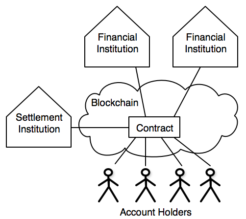
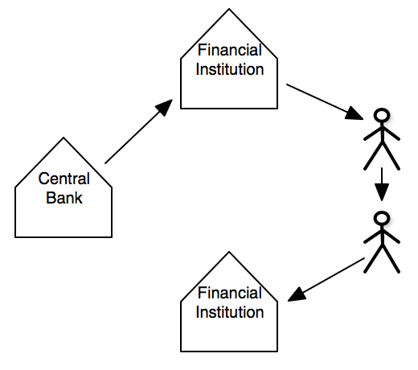

Fiat-Backed Token on a Distributed Ledger
=========================================

# Problem Statement
*A model for creating a [fiat](#fiat-currency)-backed [token](#token) that can be used by the next generation of services deployed on a [distributed ledger](#distributed-ledger).*

At its heart, the model has a [smart contract](#smart-contract) that facilitates the exchange of fiat-backed tokens between [distributed customers](#distributed-customers) who have deposited fiat with financial institutions. The contract also facilitates the settlement of real fiat currency between financial institution accounts held by a third party settlement institution.

# Why a distributed ledger?
## Alternative Payment Rail
**Credit transfers** of a fiat currency is simple to do but that's already available in a lot of places around the world using traditional payments technology. The key difference is the holder of the fiat-backed tokens are in control. They only need to sign transaction and then broadcast their transfer instruction for the transfer of their fiat-backed tokens to be executed. They do not need to send instructions to a mediating financial institution that then executes the transfer with other financial institutions on their behalf.

**Direct debits** can also be support like traditional payment systems. One advantage over traditional technology is debit limits that can be dynamically set by the debtor to each of their creditors. Coordinating debit limits between banks in realtime is just too hard to achieve without a consensus layer with signed transactions.

**Escrow** of a fiat currency is expensive and time consuming using traditional means but can be done easily on a distributed ledger. Fiat-backed tokens can be entrusted to a third party or a smart contract which will only execute when certain conditions have been met. It's also posible to setup multi signature escrows where m of n parties need to sign a transaction for the fiat-backed tokens to be released.

## Delivery versus payment
When combined with other asset backed tokens on a distributed ledger, assets can be exchanged for fiat currency in one atomic transaction. That is, the distributed ledger ensures a payment is made for the delivery of a asset.

## Programmable money
When combined with smart contracts, payments can be made on conditions being met. This could be on condition of another transaction or elapsed time.

Payments can also be based on the state of a smart contract. For example, fiat-backed tokens could be disbursed to the token holders based on the proportion of their tokens held.

# Design

## Principles
* Financial institutions will on-boarded new customers.
* The association of the distributed ledger identity to the actual customer will be kept off the distributed ledger.
* Financial institutions will issue the fiat-backed token to their customers.
* Financial institutions can only issue fiat-backed tokens if they have enough fiat held in their account held at the settlement institution.
* Customers sign distributed ledger transactions with their own private keys which will move the fiat-backed token between customers.
* The settlement institution will move fiat held in financial institution accounts on a net deferred basis.

## Benefits over alternative models
* Complies with KYC/AML laws as the financial institutions on-board new customers.
* New fiat currency is not issued into the economy's monetary supply as the fiat-backed token just represents a balance of already issued fiat currency held at a settlement institution.
* Payments can be made to a payee (Creditor) with a different financial institution to the payer (Debtor).
* Financial Institutions can still create money through lending.
* Regulators can get realtime visibility of financial transactions. This also reduces the obligations/costs of financial institutions reporting to the regulators.
* Customers are in control of their fiat currency. They do not need to instruct their financial institution to execute transactions on their behalf in closed payment schemes.

## Actors

Actor | Description
------|-----------
Token Holder | is the entity that has deposited fiat currency to a financial institution. They are the customer of the financial institution and can be an individual, company, self managed super fund, trust, another financial institution or government.
Financial Institution | holds the fiat deposited by the Token Holder. This is called the Authorised Deposit-Taking Institution (ADI) in Australia and includes banks, building societies and credit unions.
Settlement Institution | settles fiat currency between the participating financial institutions. A financial institution that offers clearing and settlement services is usually called a Clearing House but this term can be confusing here as the clearing is done on the blockchain - not the Clearing House.
Blockchain Contract | is code deployed to the blockchain that maintains the fiat-backed token balances of the token holders and fiat currency held in financial institution accounts at the settlement institution.

### Responsibilities
#### Financial Institutions
* must verify the blockchain identify of their token holders before creating a blockchain account for them. In Ethereum terms, the financial institution must verify the token holder has control of the token holder's externally owned account. In cryptography terms, the financial institution must verify the private key of the blockchain identity has signed a message of their choosing using the public key of the blockchain identity.
* Creates accounts on behalf of their token holders in the blockchain contract.
* Credits or debits the fiat-backed tokens a token holder holds in the blockchain contract.

#### Settlement Institution
* is the custodian of the financial institution's fiat currency that is the collateral to the fiat-backed tokens issued to the token holders in the blockchain contract.
* Creates settlement accounts on behalf of the financial institutions in the blockchain contract.
* Executes instructions from the financial institutions to credit or debit fiat currency to the settlement accounts in the blockchain contact.
* Periodically settles fiat currency between financial institutions that have resulted from movements between blockchain accounts.

#### Token Holder
* Can transfer fiat-backed tokens from their blockchain account to another blockchain account. In ISO terms, the debtor initiates a credit transfer to a creditor. This does not have to be done via the financial institution of the token holder. The token holder can directly access the blockchain to transfer fiat-backed tokens.
* Can instruct their financial institution to convert their deposited fiat currency to fiat-backed tokens. The token holder can not directly issue fiat-backed tokens to the blockchain contract.

#### Blockchain Contract
* Ensures financial institutions can not issue more fiat-backed tokens to their customers, the token holders,than the fiat currency they have held in their account at the settlement institution.
* Ensures there are enough fiat-backed tokens in the senders account when transferring between token holders.
* Reports the amounts to be settled between financial institutions

## Processes
See [processes](./Processes.md)

## Blockchain Contract Use Cases
See [Use Cases](./UseCases.md)

# Problems with alternative solutions
## Native Digital Currencies
Native digital currencies like Bitcoin and Ether are the inbuilt tokens of the Bitcoin and Ethereum platforms. They can be issued at the genesis of the Blockchain and/or created through the production of transaction blocks (mining).

Problems with native digital currencies:
* For most businesses, native digitial currencies like Bitcoin are:
    * too volatile to hold on their balance sheet
    * cost too much to convert to/from fiat currencies
* are designed to avoid regulatory requirements like KYC/AML.
* public digital currencies:
    * are slow
    * are not final
    * can not scale

## Central Bank Issued Digital Currencies
Are tokens issued by a central bank like it mints physical cash. These tokens would then be transferred to financial instututions that would then transfer them to their customers. The tokens do not have to be on a blockchain.

Problems with central banks issuing digital currencies:
* Central banks aren't setup to service retail or business customers. This is the role of the financial institutions.
* The currency would typically be held by an reatil or commercial customers in their wallet and not on the balance sheets of financial institutions.
* Financial institutions can not create fiat currency through lending if central banks are the only ones who can issue digital fiat currencies.

## Financial Institution Digital Currencies
There are few ways financial institutions can issue their own digital currency. The main ones are:
1. issue directly to their customers with no interoperability with other financial institutions

2. issue on a platform like Ripple that allows market makers to bridge the movement of fiat-backed tokens between financial institutions.

Problems with financial institutions issuing digital currencies:
* Digital currencies issued by different financial institutions will be priced differently as they each have different credit risks to the depositors. One digital dollar at a large, conservative bank will be valued differently to a digital dollar at a smaller, community bank.
* Interoperability between digital currencies issued by financial institutions is a problem. Technologies like Ripple and Stellar try to solve this but they rely on market makers (liquidity providers) sitting between the financial institutions.

## Traditional Payment Schemes
Traditional payment schemes covers:
    * batched based, domestic payments. eg DE and BACS
    * real time gross settlement (RTGS)
    * real time payments. eg NPP, G3 and UK Faster Payments
    * card schemes. eg Visa, Master Card and American Express

Problems with traditional payment schemes:
* The infrastructure of tradition payment schemes are expensive which limits the participants to larger financial insititutions that can afford the upfront capital costs.
* Payment schemes that settle between financial institutions on a net deferred basis create a credit default risk.
* Direct debits take 3 days to clear in Australia. This can be worked around with NPP's request for payment but it requires action by the debtor.
* Escrow services for fiat currencies are expensive and time consuming to establish.

# Glossary of Terms
| Term | Description |
| -----|------------ |
| Distributed Ledger | a peer-to-peer, append only datastore that uses consensus to synchonise cryptographically secured data. |
| Blockchain | is a distributed ledger that batches transactions into blocks. |
| Blockchain identity | In Ethereum is is referred to as an externally owned account. In Bitcoin this is referred to an address. This concept does not currently exist in Hyperledger Fabric. |
| Blockchain contract | is used instead of the term smart contract. Is the deployment of both code and state onto a blockchain platform |
| Smart Contract | An instance of a distributed object deployed on a distributed ledger. |
| Distributed Object | Is the deployment of both state logic onto a Blockchain/distributed ledger. |
| State | Structured data held in variables of a distributed object. |
| Logic | Rules defined in functions that read and modify a distributed object's state. |
| Distributed Services | Are commercial services deployed on a distributed ledger platforms. Fir example, tokenisation of assets |
| Token | A digital unit of a real or virtual asset that can be assigned to a blockchain identity. |
| Transactions | A signed instruction that changes the state of a distributed ledger. |
| Distributed Customers | Are users of the distributed ledger that own, or are in control, of asset-backed tokens like a fiat-backed token. |
| Fiat Currency | legal tender whose value is backed by the government that issued it. For example, Australian dollars issued by the Reserved Bank of Australia. |